# CluckTalk: A Cross-Platform Mobile Application for Poultry Vocalization Education and Welfare Monitoring

[](https://flutter.dev)
[](https://dart.dev)
[](#)
[](LICENSE)

---

## 1. Project Overview & Software Description

CluckTalk is an interactive, cross-platform mobile application engineered to translate complex poultry bioacoustics and vocalization research into an accessible, educational framework for precision livestock farming (PLF). While bioacoustics research continuously links poultry vocal sound waves to distinct emotional, metabolic, and ambient stressors, there remains a critical gap in translating these insights for farmers, veterinary students, and agricultural personnel.

CluckTalk bridges this gap by functioning as an interactive training environment. It enables users to browse, search, visually inspect, and classify poultry vocalizations across nine distinct behavioral domains.

---

## 2. Software Architecture Documentation

CluckTalk is intentionally designed around an **offline-first, zero-cloud architecture**. Unlike alternative cloud-dependent agricultural suites, CluckTalk runs entirely decoupled from remote server infrastructure, external RESTful APIs, cloud pipelines, or active internet dependencies. This architectural choice achieves:

- **Ultra-Low Latency:** Real-time audio waveform transformations and instantaneous media playback loops.
- **Biosecurity & Portability:** Reliable application functionality directly within remote, shielded farm environments lacking cellular or Wi-Fi data infrastructure.
- **Data Privacy:** Local storage execution guarantees no data leaves the user's terminal device.

### Three-Layer Architecture Schema

Architecturally, the software is divided into three interacting layers running strictly inside the local runtime sandbox:

```mermaid
%%{init: { 'themeVariables': { 'fontFamily': 'Arial, sans-serif', 'fontSize': '16px', 'subTitleFontSize': '14px' } } }%%
flowchart TB
 subgraph ClientDevice["📱 ON-DEVICE SMARTPHONE PLATFORM (Self-Contained)"]
        subgraph Layer1["1. EDUCATIONAL ASSESSMENT LAYER"]
            M1["Guided Onboarding <br><i>(Conceptual Framing)</i>"]
            M2["Category-Based Exploration <br><i>(Taxonomy Learning)</i>"]
            M6["Quiz-Based Feedback <br><i>(Auditory Reinforcement)</i>"]
        end
        subgraph Layer2["2. FLUTTER INTERACTION & PRESENTATION LAYER"]
            subgraph UI_Modules["User Interface Controls"]
                M3["Search System"]
                M4["Playback Detail Interface"]
                M5["Quiz Interaction Screen"]
            end
            subgraph Frameworks["Flutter Stack Core Logic Engine"]
                GetX["GetX Framework <br><i>State & Navigation</i>"]
                AP["Audioplayers Core <br><i>Sound Playback Engine</i>"]
                AW["Audio Waveforms <br><i>Waveform Rendering</i>"]
                SP["Shared Preferences <br><i>State Transitions</i>"]
                Utils["UI Utilities <br><i>flutter_svg / toast</i>"]
            end
        end
        subgraph Layer3["3. LOCAL POULTRY VOCALIZATION ASSET REPOSITORY"]
            Taxonomy[("9-Category Behavioural Taxonomy")]
            Metadata[("Annotated Call Metadata <br><i>Duration, Labels & Context</i>")]
            Images[("Representative Image Assets <br><i>assets/images/</i>")]
            subgraph AudioLibrary["Sound Files (.mp3 / .wav)"]
                A1["Social Calls"]
                A2["Distress Calls"]
                A3["Hunger & Feeding Calls"]
                A4["Rooster Calls"]
                A5["Hen & Chicks Clucks"]
                A6["Mating Calls"]
                A7["Aggression & Warning"]
                A8["Content & Relaxed"]
                A9["Unique Calls"]
            end
        end
 end
    M1 -->|Initial Setup| GetX
    M2 -->|Browsing View| M4
    M2 -->|Query Request| M3
    M6 -->|Evaluation Event| M5
    M3 -->|Text Query Filtering| GetX
    M4 -->|Audio Control Stream| AP & AW
    M5 -->|User Answer Event| GetX
    AP -->|Direct File Playback| AudioLibrary
    AW -->|Buffer Waveform Rendering| AudioLibrary
    GetX -->|Taxonomy Mapping| Taxonomy
    GetX -->|Metadata Query| Metadata
    Utils -->|Vector Asset Load| Images
    SP -->|On-Device State Cache| Metadata
    classDef layer fill:#f4f5f7,stroke:#333,stroke-width:2px,font-weight:bold
    classDef module fill:#e1f5fe,stroke:#0288d1,stroke-width:1.5px
    classDef package fill:#e8f5e9,stroke:#2e7d32,stroke-width:1.5px
    classDef storage fill:#fff3e0,stroke:#ef6c00,stroke-width:1.5px
    style ClientDevice fill:#fafafa,stroke:#777,stroke-width:2px,stroke-dasharray: 5 5


```



---

## 3. Flutter & Dart Technology Stack Details

The runtime ecosystem is established utilizing the high-performance Flutter UI toolkit compiled against native platforms. Core library dependencies are frozen to ensure maximum pipeline reproducibility based on your project's configuration:

- **Ecosystem Engine:** `Dart SDK >=3.4.3 <4.0.0` / `Flutter SDK`
- **State & Navigation Router:** `get: ^4.7.2` — Orchestrates reactive bindings and view transitions without boilerplate context dependencies.
- **Audio Engine Processing:** `audioplayers: ^6.2.0` — Manages low-level native channel interactions for multi-format audio asset decoding.
- **Waveform Visualization:** `audio_waveforms: ^1.3.0` — Directly buffers and converts binary sample frames into graphical frequency representations.
- **Local Workspace Flag Caching:** `shared_preferences: ^2.2.3` — Caches basic application flag variables locally on the hardware platform.
- **UI Vector Component Utilities:** `flutter_svg: ^2.0.10` & `fluttertoast: ^8.0.9`

---

## 4. Poultry Vocalization Taxonomy & Categories

The software embeds a curated behavioral vocalization matrix categorized into nine targeted operational buckets. Each folder contains high-fidelity raw audio samples paired with domain-specific metadata maps:

| Asset Directory Pipeline                | Behavioral Target Mapping | Research Context & Informational Scope                                        |
| --------------------------------------- | ------------------------- | ----------------------------------------------------------------------------- |
| `assets/sounds/Social Calls/`           | **Social Calls**          | Baseline contact signals mapping standard group cohesion patterns.            |
| `assets/sounds/Distress Calls/`         | **Distress Calls**        | High-frequency stress vocalizations indicative of thermal or physical trauma. |
| `assets/sounds/Hunger & Feeding Calls/` | **Hunger & Feeding**      | Periodic acoustic signatures emitted during intensive feeding spikes.         |
| `assets/sounds/Rooster Calls/`          | **Rooster Calls**         | Temporal crowing profiles highlighting territory demarcation.                 |
| `assets/sounds/Hen & Chicks Clucks/`    | **Hen & Chicks**          | Low-amplitude maternal communication channels essential for brooding.         |
| `assets/sounds/Mating Calls/`           | **Mating Calls**          | Pre-copulatory signaling sequences indicating reproductive status.            |
| `assets/sounds/Aggression & Warning/`   | **Aggression & Warning**  | Threat displays, competitive exclusion signals, and warning triggers.         |
| `assets/sounds/Content & Relaxed/`      | **Content & Relaxed**     | Low-frequency, calm background comfort sounds.                                |
| `assets/sounds/Unique Calls/`           | **Unique Calls**          | Atypical acoustic behaviors denoting anomalous physiological expressions.     |

---

## 5. Application Screenshots & User Interface

The repository contains visual configurations outlining screen layouts from physical iPhone device runs:

- `docs/screenshots/dashboard.png` — Unified Home Dashboard View showing Top Search Bar and Filter Rows.
- `docs/screenshots/playback.png` — Interactive Playback Sub-System showing Audio Waveforms and Chicken Photographs.
- `docs/screenshots/quiz.png` — Quiz Assessment & Standalone State Educational Feedback Screens.

---

## 6. Installation & Developer Instructions

### Prerequisites

- Install the **Flutter SDK** (v3.4.3 or higher stable release).
- Configure target emulator platforms or unlock a physical development smartphone node (USB Debugging active).

### Initializing Environment

Clone the repository path and execute local asset pipeline packaging:

```bash
# Clone repository
git clone [https://github.com/MooAnalytica/CluckTalk.git](https://github.com/MooAnalytica/CluckTalk.git)
cd CluckTalk

# Pull and link package manifest specifications
flutter pub get

# Execute a health verification pass on the environment setup
flutter doctor

```

### Direct Local Compilation

To compile and spin up the runtime builds locally on your workstation, use the direct target run directives:

```bash
# Run application in development debug mode on connected target device
flutter run

```

---

## 7. Testing & Validation Documentation

Unit and widget testing definitions reside inside the dedicated `/test` folder framework. Verify software stability, router definitions, and asset access states prior to build deployment:

```bash
# Execute the automated test validation runner suite
flutter test

```

The test suite explicitly evaluates asset mapping validation, text-matching search parameters, and functional state changes across the evaluation pages.

---

## 8. Deployment Information (Android & iOS)

To compile clean, self-contained standalone application builds without server wrappers, call the native building pipelines:

```bash
# Compile high-performance Android App Bundle (Release AFT)
flutter build appbundle --release

# Compile native iOS distribution package archive
flutter build ipa --release

```

---

## 9. SoftwareX Manuscript Materials & Figures

All metadata, high-resolution manuscript layout diagrams, and raw figures needed for SoftwareX evaluation are organized within the root directory path:

- `docs/manuscript/` — Source `.docx` format documents.
- `docs/figures/` — High-resolution `.svg` and `.png` image formats representing **Figure 1 (Overall Architecture)**.

---

## 10. Citation & Licensing Information

### License

This system is open-source and distributed under the terms of the **MIT License**. See the `LICENSE` file for full disclosure details.

### Authors

Daniel Edison Essien

Suresh Raja Neethirajan

MooAnalytica Research Group Dalhousie University Canada
